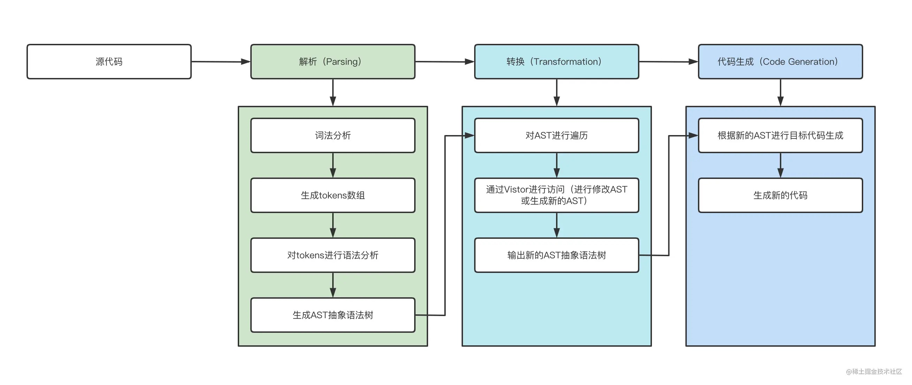

## AST(抽象语法树)

> 来源: [https://juejin.cn/post/7155151377013047304](https://juejin.cn/post/7155151377013047304)

一个完整的编译器整体流程分为以下三个步骤:

1. **Parsing(解析过程)**: 这个过程经 `词法分析`, `语法分析`, `构建AST(抽象语法树)` 一系列操作
2. **Transformation(转化过程)**: 这个过程将上一步解析结果按照编译器指定的规则进行处理, 形成一个新的表现形式
3. **Code Generation(代码生成)**: 将上一步处理好的内容按照自己的需求转化为新的代码

如下图所示:

### Progressing

- [入门尝鲜](./simple.js)
- [原版使用babel-plugin-transform-es2015-arrow-functions](./plugins/use-transform-es2015-arrow-functions.js)
- [实现简易版babel-plugin-transform-es2015-arrow-functions](./plugins/babel-plugin-arrow-function.js)
- [实现自定义console.log 信息插件](./plugins/babel-plugin-console.js)
- [实现监控系统日志插件](./plugins/babel-plugin-auto-import-log.js)
- [实现no-console的eslint插件](./plugins/babel-plugin-no-console-eslint.js)
- [实现代码压缩插件](./plugins/babel-plugin-uglify.js)
- [实现lodash按需加载插件](./plugins/babel-plugin-import.js)
- [实现TypeScript类型校验插件 - 直接赋值场景](./plugins/babel-plugin-ts-check.js)
- [实现TypeScript类型校验插件 - 先声明后赋值场景](./plugins/babel-plugin-ts-check2.js)
